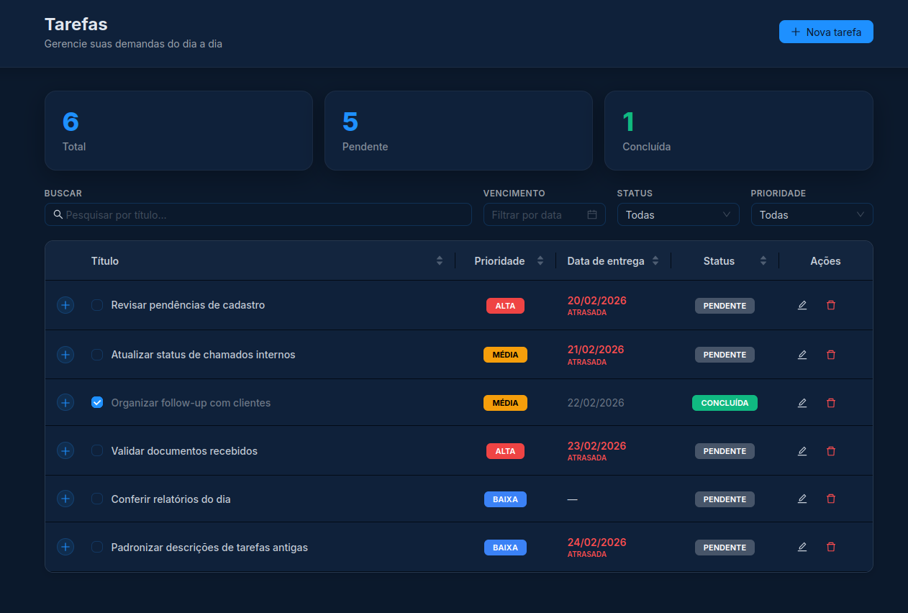
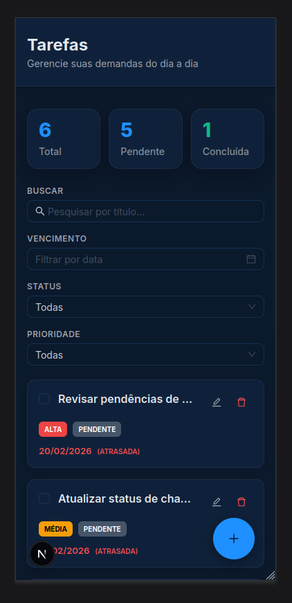

# 🚀 Case Técnico — Banco Bari

Um painel de gerenciamento de tarefas operacionais moderno, focado em performance e usabilidade. Este projeto foi desenvolvido como parte do desafio técnico para o Banco Bari.

## 📸 Preview





> **Note:** Dashboard view featuring task listing, priority tags, and status management.

## 🛠️ Tecnologias Utilizadas

Este projeto foi construído utilizando o ecossistema React:

- **Framework:** [Next.js 14+](https://nextjs.org/) (App Router)
- **Linguagem:** [TypeScript](https://www.typescriptlang.org/)
- **UI Library:** [Ant Design (AntD)](https://ant.design/)
- **Estilização:** [CSS Modules](https://github.com/css-modules/css-modules) (Vanilla CSS)
- **Manipulação de Datas:** [Day.js](https://day.js.org/)
- **Iconografia:** [Ant Design Icons](https://ant.design/components/icon)

## Funcionalidades Principais

- **Dashboard de Estatísticas:** Visualização rápida do total de tarefas, pendências e itens concluídos com cores semânticas.
- **Gestão de Tarefas (CRUD):** Criação, edição, exclusão e conclusão de tarefas com persistência.
- **Design 100% Responsivo:**
  - **Desktop:** Visualização em tabela rica com ordenação e filtros avançados.
  - **Mobile:** Visualização em cards otimizados para toque e Floating Action Button (FAB).
- **Filtros Inteligentes:** Busca por texto, status, prioridade e data de vencimento específica.
- **Ordenação Flexível:** Ordene por qualquer coluna (Título, Data, Prioridade, Status).
- **Persistência Local:** Utiliza `localStorage` para manter os dados mesmo após recarregar a página.
- **Feedback Visual:** Alertas de tarefas atrasadas e tooltips dinâmicos.

## Como Iniciar o Projeto

Siga os passos abaixo para rodar a aplicação localmente:

1.  **Instale as dependências:**

    ```bash
    npm install
    ```

2.  **Inicie o servidor de desenvolvimento:**

    ```bash
    npm run dev
    ```

3.  **Acesse no seu navegador:**
    Abra [http://localhost:3000](http://localhost:3000)

## 📐 Decisões de Arquitetura

- **Mobile-First Adaptativo:** Em vez de apenas esconder colunas da tabela no celular, optei por trocar o componente de visualização para `Cards`. Isso melhora drasticamente a experiência em telas pequenas (UX).
- **Custom Hooks:** Toda a lógica de estado e persistência foi centralizada no hook `useTasks.ts`, mantendo os componentes de UI limpos e focados apenas na renderização.
- **Segurança de Tipos:** O uso exaustivo de `Enums` e `Interfaces` TypeScript garante que erros de "magic strings" sejam evitados e facilita a manutenção do código.
- **Dark Mode:** O tema foi customizado através do `ConfigProvider` do Ant Design para alinhar-se à identidade visual do Banco Bari.

---

Desenvolvido por **Caio Rasera** para o Desafio Técnico Bari.
